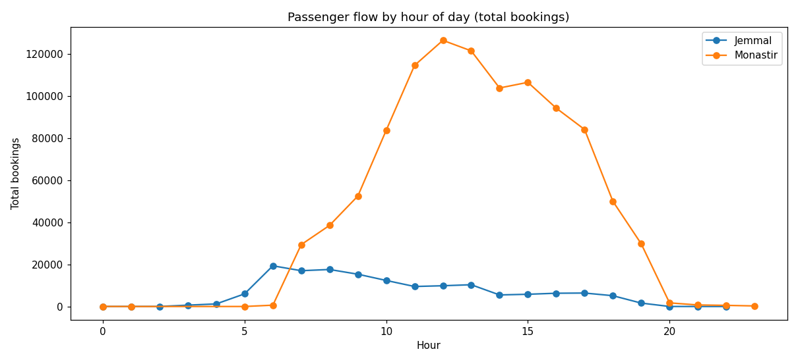

# Wasla Transport Analytics — Final Technical Report

**Intern:** Yasmine Ghomrassi (M.Sc. Statistics & Data Science, University of Palermo)
**Company supervisor:** Mr. Samer Gassouma (CEO, Backend Glitch Inc.)
**Project:** Wasla — Transport Analytics Engine
**Date:** 2026-10-08

---

## 1. Executive summary

This project builds the analytics layer on top of the live **Wasla** transport platform: extraction and unification of production data from the two live stations (Jammel-Monastir and Monastir Centre), statistical analysis, demand forecasting with anomaly detection, and an operations dashboard + API that serve the results.

**Data at a glance** (extracted 2026-10-08, ~21:00): **1,582,729 bookings** — Jemmal 355,579, Monastir 1,227,150 — spanning Oct 2025 → 8 Oct 2026, plus 15,470 trips, 39,792 day passes, 680k+ print jobs and the station transaction logs.

### The three headline findings

1. **Ghost bookings dominate volume — but Jemmal is maturing fast.** Overall, **93.4%** of bookings are pre-generated "ghost" drafts (never verified as sold). Monastir sits at 99.2% ghost, while Jemmal — the newer station — has already reached **26.5% real (sold) tickets** (94,193 real bookings). Any metric that mixes the two (especially revenue) is misleading by an order of magnitude.

2. **There are two "revenues", and both are correct.** Passengers paid **3,427,079 TND** (base fare + service fee, most of which goes to drivers). The stations themselves keep **237,729 TND** (seats × 0.15 TND + day passes × 2 TND) — a **6.9%** share. Every chart and KPI in the dashboard labels which definition it shows.

3. **Peak structure and fleet pressure are clear and actionable.** Jemmal peaks at **07h** (2.90× off-peak), Monastir at **12h** (3.24×). Jemmal's 160 vehicles average **80 trips/vehicle** at a **90.9%** load factor — the fleet is effectively saturated at the morning rush.



### What was delivered

- Phase 1 — extraction/cleaning/unification pipeline (8 tables × 2 stations → clean + features layers)
- Phase 2 — statistical analysis (flow, dual-definition revenue, routes, fleet)
- Phase 3 — walk-forward-validated forecasting (MAPE **6.0–8.5%**) + 3-detector anomaly consensus
- Phase 4 — **Next.js analytics dashboard** (`analytics_dashboard/`), 7 views, dark theme, mock ⇄ live API modes
- Phase 5 — **FastAPI analytics API + minutely WebSocket live feed + Docker compose** (`analytics_api/`, `docker-compose.yml`)

---

## 2. Data

**Sources.** Two production PostgreSQL databases on the station servers, reached **read-only** through SSH tunnels from the analytics laptop (ports 15432/15433). Tables: `bookings`, `trips`, `day_passes`, `routes`, `vehicles`, `staff`, `print_jobs`, `staff_transaction_log`.

**Cleaning & unification.** The two stations have different schemas (e.g. bookings differ by 8 columns; trips use `booked_seats` vs `seats_booked`). `02_clean.py` outer-joins the columns; the destination namespaces (`st_*` at Jemmal, `station-*` at Monastir) are unified through `DESTINATION_MAP` into 5 canonical routes. Feature engineering adds hour/day-of-week/month/real-vs-ghost flags.

**The "real vs ghost" decision.** `is_ghost_booking=true` marks pre-generated/offline drafts that were never verified as sold. **"Real" = `is_ghost=false`** (104,594 rows). Volume analytics use all bookings; revenue analytics use real only. This decision is applied consistently in every layer.

| Table | Jemmal | Monastir | Total |
|---|---:|---:|---:|
| Bookings | 355,579 | 1,227,150 | 1,582,729 |
| Real (sold) | 94,193 (26.5%) | 10,401 (0.8%) | 104,594 (6.6%) |
| Trips | 12,948 | 1,261 | 14,209 |
| Day passes | 5,146 | 34,646 | 39,792 |

---

## 3. Methodology

### 3.1 Forecasting (Phase 3)

- **Daily series** per station + consolidated total, reindexed to a continuous calendar (missing days → 0). The trailing extraction day is dropped when it falls below 25% of the prior week's volume (in this run, 8 Oct was a full-volume day and was kept).
- **Validation: walk-forward CV**, 4 expanding-window folds, each predicting the next 7 days. A single holdout split would have been misleading with only ~4 months of Jemmal history.
- Models compared: naive, seasonal naive, seasonal median, weekly mean, SARIMA, Prophet.
- **Winners:** Jemmal → **naive** (MAPE 6.3% ± 3.7%); Monastir → **seasonal naive** (8.5% ± 3.1%); Total → **SARIMA** (6.0% ± 1.8%).
- **Prophet lost consistently** (10.7–22.7% MAPE) — over-parametrised for short histories. Kept in the code but not built around.

### 3.2 Anomaly detection

Three independent detectors + consensus rule:
1. **Rolling z-score** (30-day window)
2. **Week-over-week difference z-score** (catches level shifts a plain z-score misses)
3. **Isolation Forest** on weekly profile features

A day is flagged when ≥2 detectors agree (consensus), with an explicit **zero-day rule** for days with 0 bookings.

---

## 4. Results

### 4.1 Passenger flow

| Station | Total bookings | Real (sold) | Ghost rate | Avg/day | Peak hour | Peak/off-peak |
|---|---|---:|---:|---:|---:|---:|
| Jemmal | 355,579 | 94,193 | 73.5% | 3,175 | **07h** | 2.90× |
| Monastir | 1,227,150 | 10,401 | 99.2% | 3,428 | **12h** | 3.24× |

### 4.2 Revenue — both definitions

| Station | Passenger-paid (A) | Station fee, bookings (B) | Day-pass fee | Real-bookings revenue |
|---|---:|---:|---:|---:|
| Jemmal | 956,248 TND | 53,383 TND | 10,292 TND | 436,300 TND |
| Monastir | 2,470,831 TND | 184,346 TND | 66,366 TND | 20,567 TND |
| **Consolidated** | **3,427,079 TND** | **237,729 TND** (+76,658 day-pass) | | **456,867 TND** |

The station's share (B) is **6.9%** of what passengers pay (A). Monastir's real-booking revenue is small because 99.2% of its bookings are still ghost — treat as an early-operations signal, not a final number.

### 4.3 Routes

| Station | Route | Bookings | Revenue (A) | Avg ticket | Ghost rate |
|---|---|---:|---:|---:|---:|
| Jemmal | Monastir | 144,485 | 281,855 TND | 1.95 | 99.7% |
| Jemmal | Sousse | 87,670 | 249,765 TND | 2.85 | 28.5% |
| Jemmal | Ksar Hlel | 82,452 | 119,567 TND | 1.45 | 99.9% |
| Jemmal | Souassi | 30,953 | 147,084 TND | 4.75 | 32.0% |
| Jemmal | **Tunis** | 9,952 | **157,728 TND** | **15.85** | **1.0%** |
| Monastir | Jemmal | 508,292 | 992,149 TND | 1.95 | 99.9% |
| Monastir | Ksar Hlel | 439,344 | 835,950 TND | 1.90 | 100.0% |
| Monastir | Moknin | 186,105 | 410,102 TND | 2.20 | 100.0% |
| Monastir | Teboulba | 83,424 | 213,072 TND | 2.55 | 100.0% |

**Jemmal→Tunis is the premium route**: 15.85 TND average ticket, 1.0% ghost rate — the only near-fully-real route in the network.

### 4.4 Fleet

| Station | Trips | Vehicles | Trips/vehicle | Avg load factor | Capacity coverage |
|---|---:|---:|---:|---:|---:|
| Jemmal | 12,948 | 160 | 80.0 | **90.9%** | 99% |
| Monastir | 1,261 | 112 | 9.2 | 98.5%* | **33%** |

\* Monastir trips carry `vehicle_capacity` on only 33% of rows → its load factor is indicative.

### 4.5 Forecasting (walk-forward CV MAPE)

| Series | Winner | MAPE (CV) | 7-day forecast (9→15 Oct) |
|---|---:|---:|---|
| Jemmal | naive | 6.3% ± 3.7% | 3,535/day (flat) |
| Monastir | seasonal naive | 8.5% ± 3.1% | 4,355 → 3,845 |
| **Total** | **SARIMA** | **6.0% ± 1.8%** | **7,402 → 7,333** (95% CI ≈ ±1,200–1,900) |

### 4.6 Anomalies (consensus)

| Date | Series | Bookings | Type |
|---|---|---|---|
| 2026-06-29 | Jemmal | 2,553 | Positive spike (all 3 detectors) |
| 2026-01-20 | Monastir | 0 | Zero-day |
| 2026-05-27 | Monastir | 0 | Zero-day |

---

## 5. Limitations & caveats

1. **Ghost vs real.** Volume models include ghost drafts by design; revenue models use real only. Mixing them distorts revenue 10–15×.
2. **Short Jemmal history** (~4 months). Month-of-year seasonality is unmeasured — keep horizons at 7 days until a full quarter exists.
3. **Monastir fleet data is sparse** — capacity on 33% of trips, and trip recording lags (ends 2026-09-17). Fleet numbers there are indicative.
4. **Partial extraction-day artifact.** The last day is dropped automatically when <25% of the prior week. (Not triggered in this run.)
5. **Tunnels are laptop-bound.** The live feed works while this machine is on and the SSH tunnels are up; it degrades to `live:false` otherwise (by design — REST stays up from cached artifacts).
6. **Cancellations are essentially absent** (0.128% Jemmal / 0.004% Monastir) — no cancellation analytics built.

---

## 6. Recommendations

1. **Capacity to the peaks.** Staff/vehicle dispatch at Jemmal 06–08h and Monastir 11–13h; Jemmal's 90.9% load factor means near-zero slack at the rush.
2. **Monitor ghost-rate drift.** Sustained >98% ghost at a station (like Monastir today) suggests tickets are generated but not verified — investigate the operator workflow, not the data.
3. **Forecast revenue on the real subset only**; continue forecasting volume on all bookings. Revisit seasonality after a full quarter of Jemmal data.
4. **Keep the dual-revenue labels everywhere** (dashboard already does) — the 6.9% station share vs passenger-paid gap is the single most surprising number for stakeholders.
5. **Operationalize the live feed.** The `/ws/live` minutely tick + consensus anomaly banner are ready; a daily `POST /api/refresh` keeps the artifact cache current without restarts.
6. **Deployment path.** `docker compose up --build` (API :8000, dashboard :3001) is the local demo; the same compose file moves to the VPS with env-driven DB URLs when the tunnels are relocated.

---

## 7. Appendix — how to run everything

```bash
# Tunnels (read-only)                      # see Phase_1/NOTES.md
sshpass -p 'post' ssh -fN -L 15432:localhost:5432 server@100.72.205.59
sshpass -p 'ste2025' ssh -fN -L 15433:localhost:5432 ste@100.123.86.114

# Re-run the data pipeline
cd Phase_1 && python3 02_clean.py && python3 03_features.py && python3 04_eda.py
cd ../Phase_2 && python3 01_flow.py && python3 02_revenue.py && python3 03_routes.py && python3 04_fleet.py && python3 05_report.py
cd ../Phase_3 && python3 01_prep.py && python3 02_models.py && python3 03_forecast.py && python3 04_anomalies.py && python3 05_report.py

# Regenerate + verify dashboard mocks
cd ../analytics_dashboard && python3 scripts/gen_mocks.py && python3 scripts/verify_mocks.py

# Dashboard (mock mode / live API mode)
NEXT_PUBLIC_USE_MOCK=1 pnpm dev     # or: pnpm dev  (needs the API on :8000)

# API (live feed needs tunnels)
cd ../analytics_api && .venv/bin/uvicorn app.main:app --port 8000

# Docker demo
docker compose up --build            # dashboard :3001, API :8000
```

### File map

| Deliverable | Location |
|---|---|
| Raw / clean / features data | `Phase_1/data/{raw,clean,features,eda}/` |
| Stats report + charts | `Phase_2/STATS_REPORT.md`, `Phase_2/charts/` |
| Forecast report + models | `Phase_3/FORECAST_REPORT.md`, `Phase_3/models/`, `Phase_3/output/` |
| Dashboard | `analytics_dashboard/` (mock JSON in `public/mock/`) |
| API | `analytics_api/` (FastAPI + `/ws/live`) |
| Docker | `docker-compose.yml`, `README_DOCKER.md` |
| Design & implementation plan | `docs/superpowers/specs/`, `docs/superpowers/plans/` |

**Charts cited:** `Phase_2/charts/flow_hourly.png`, `flow_daily.png`, `revenue_daily.png`, `revenue_by_route.png`, `revenue_real_vs_ghost.png`, `route_performance.png`, `fleet_load_factor.png`; `Phase_3/charts/*`.
