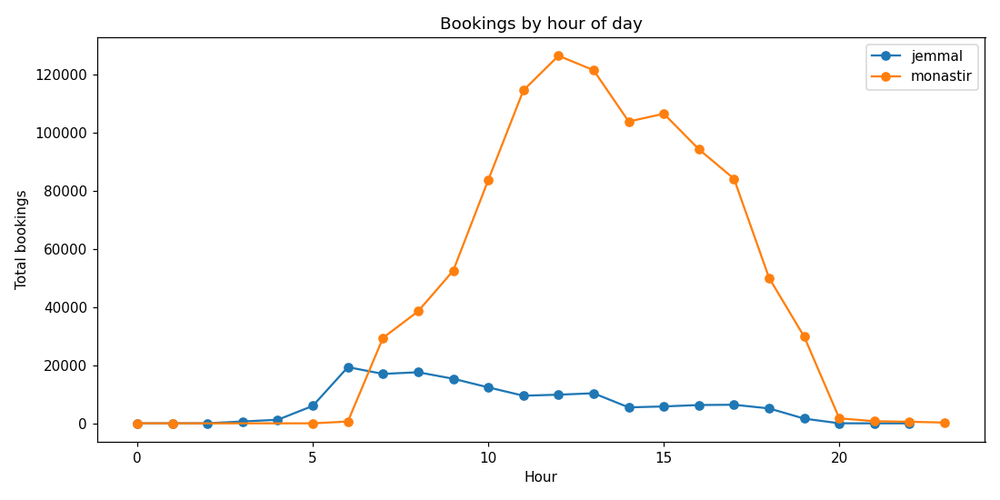
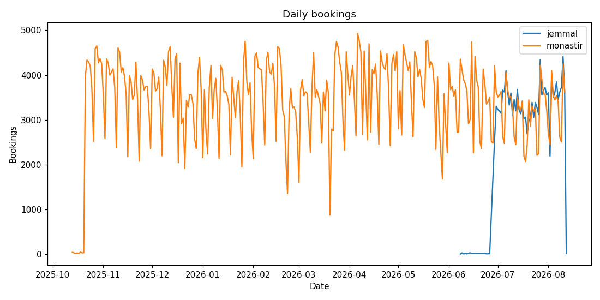
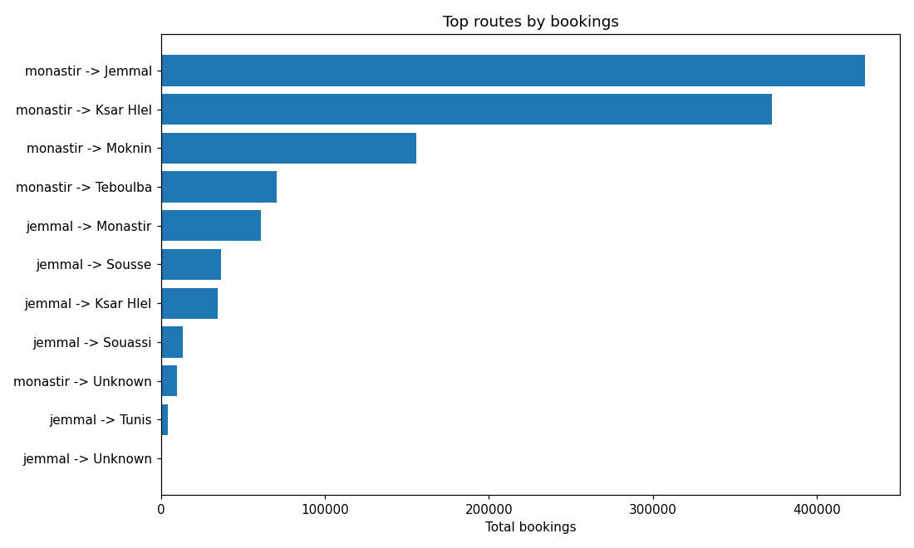
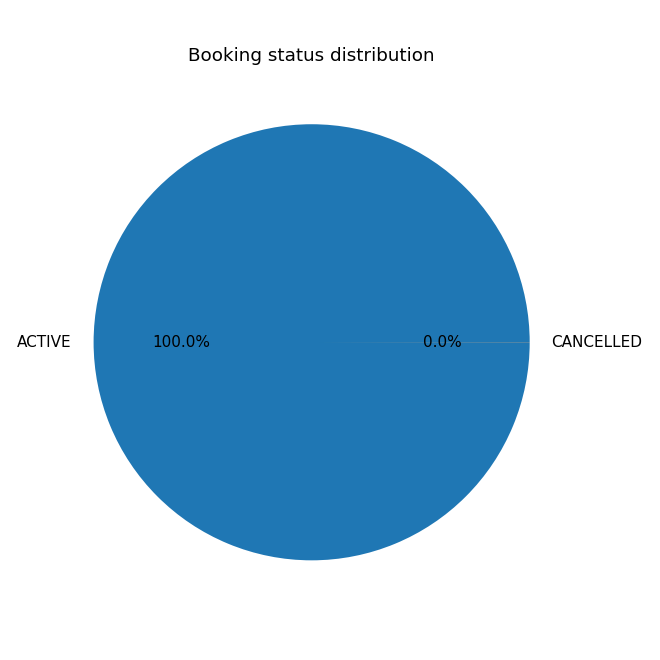

# Phase 1 EDA Summary

- Generated: 2026-08-12 04:47

## Data volumes

- Total bookings: **1,188,298**
- By station: monastir=1,038,329, jemmal=149,969
- Date range: 2025-10-13 06:39:55.585000 -> 2026-08-12 04:09:38.509692

## Booking status

- ACTIVE: 1,188,183 (99.99%)
- CANCELLED: 115 (0.01%)

## Ghost bookings

- Ghost: 1,151,268 (96.88%)

## Hourly demand (peak hours)

- jemmal: 6h (19,322), 8h (17,570), 7h (16,999)
- monastir: 12h (126,365), 13h (121,376), 11h (114,461)

## Revenue

- Total revenue (bookings): **2,499,055 TND**
- Avg revenue/booking: 2.10 TND

## Route performance

- jemmal -> Monastir: 60,918 bookings, avg 1.95 TND
- jemmal -> Sousse: 36,681 bookings, avg 2.85 TND
- jemmal -> Ksar Hlel: 34,533 bookings, avg 1.45 TND
- jemmal -> Souassi: 13,421 bookings, avg 4.75 TND
- jemmal -> Tunis: 4,349 bookings, avg 16.30 TND
- monastir -> Jemmal: 429,293 bookings, avg 1.95 TND
- monastir -> Ksar Hlel: 372,625 bookings, avg 1.90 TND
- monastir -> Moknin: 155,867 bookings, avg 2.20 TND
- monastir -> Teboulba: 70,559 bookings, avg 2.55 TND
- monastir -> Unknown: 9,985 bookings, avg 1.96 TND

## Charts

